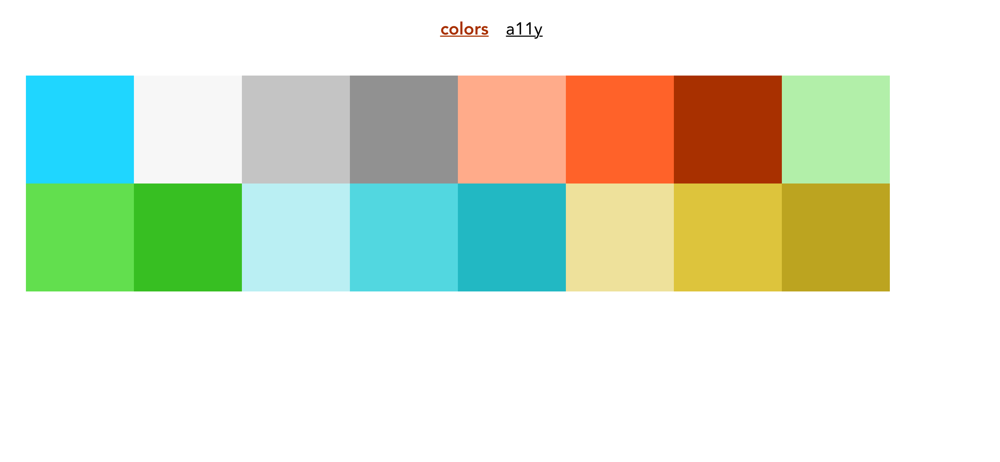

# README




This repository is used as an example for the article [final name of the article]() (*Polish*) published on the [PGS software blog](https://www.pgs-soft.com/blog/).

The project uses [@wryrych/design-tokens-example](@wryrych/design-tokens-example) *npm* package as a dependency. Each `scss` file has an access to design tokens.

```js
module.exports = {
  pluginOptions: {
    "style-resources-loader": {
      preProcessor: "scss",
      patterns: [
        path.resolve(
          __dirname,
          "node_modules/@wryrych/design-tokens-example/dist/scss/_variables.scss"
        ),
      ],
    },
  },
  …
```

## How to run

```sh
yarn
yarn serve
```